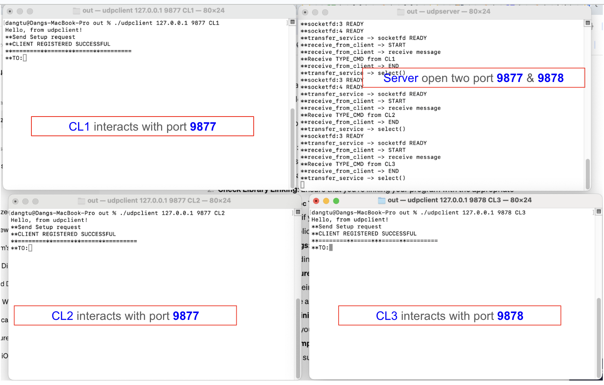
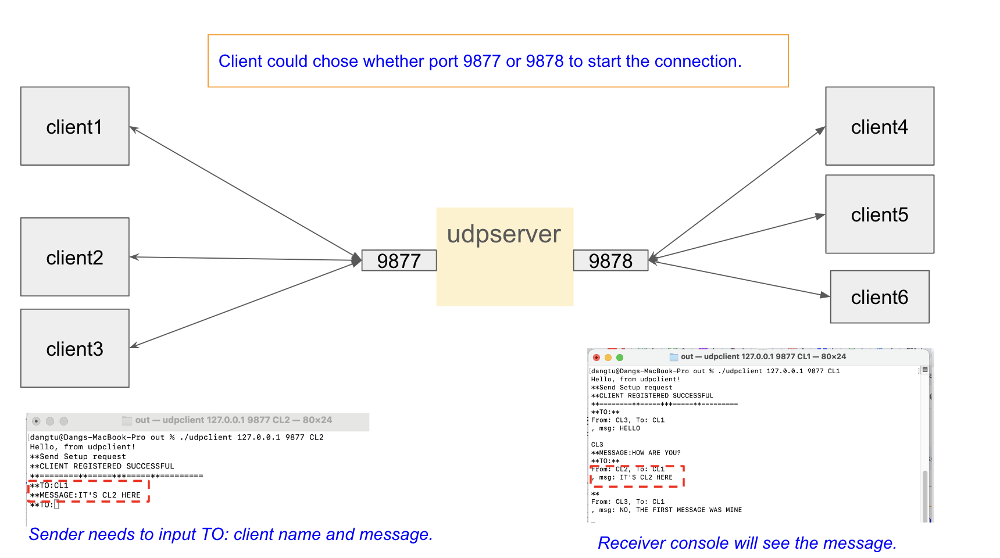

# UDP Server & Client Example

## 1. Introduction
The project example of using UDP socket with select() System Call on multiplexing.


## 2. Project Structure
```
├── CMakeLists.txt
├── README.md
├── build
│   ├── CMakeCache.txt
│   ├── CMakeFiles
│   ├── Makefile
│   ├── cmake_install.cmake
│   ├── compile_commands.json
│   └── tmp.txt
├── build.sh
├── client
│   ├── client.c
│   └── main.c
├── docs
├── inc
│   ├── client.h
│   ├── config.h
│   ├── message.h
│   ├── server.h
│   ├── unp.h
│   └── utils.h
├── lib
│   ├── libcommon_lib.a
│   ├── message.c
│   └── utils.c
├── out
│   ├── udpclient
│   └── udpserver
└── server
    ├── main.c
    └── server.c
```
### Main Directories
| No | Folder Name | Description |
|----| ------------| ------------|
| 1  | client      | Source code of udpclient app |
| 2  | Server      | Source code of udpserver app |
| 3  | inc         | Header files location |
| 34  | lib         | Source code and library of the static common lib used in the project |
| 5  | out         | The output binary archived location |

## 3. Build project
Run the build.sh script from the root folder to build the project.
## 4. Run the apps
### 4.1: Client
* Change directory to out folder and run the below command
    ```
    ./udpclient <Server machine IP> <PORT> <Client  name>
    ```
   * The Server machine IP will be 127.0.0.1 for localhost
   * The port, please use 9877 or 9878
### 4.1: Server
* Change directory to out folder and run the below command 
    ```
    ./udpserver
   ```

## 5. Limitation
* Maximum support clients is 10 clients.
* The client name will be remained in server app until server app shutdown.
* The server app and client app need to close by Ctrl - Z or kill process by manual 